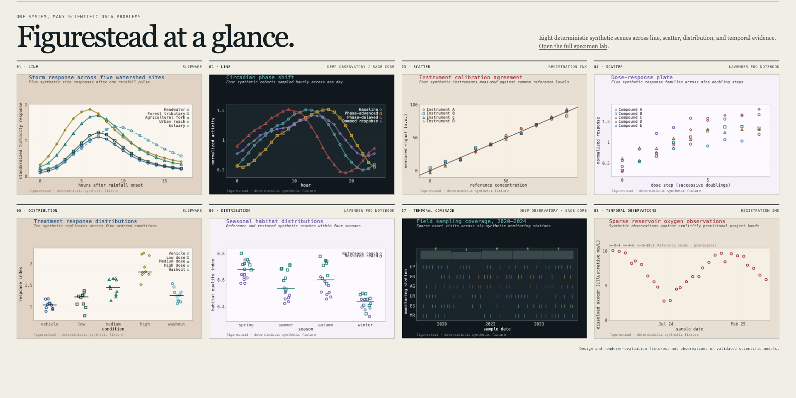
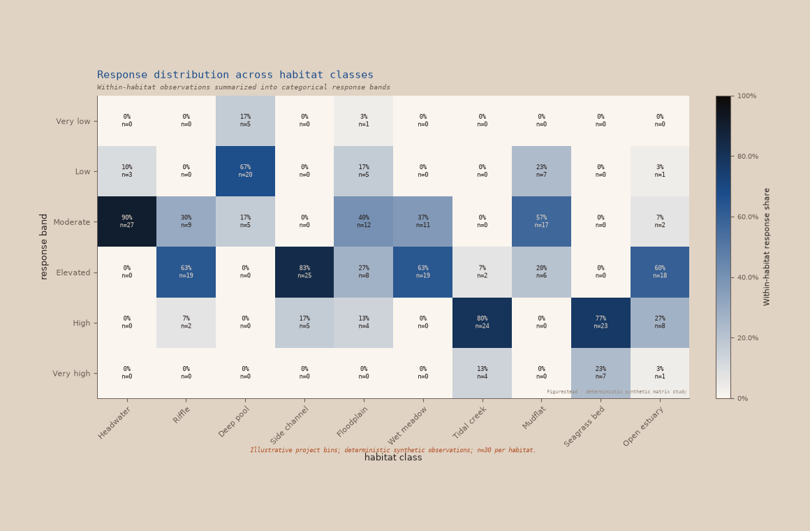

# Figurestead

Figurestead is an experimental scientific figure system with Python and framework-free browser surfaces. It shares figure-contract and theme semantics across runtimes while keeping scientific output deterministic and inspectable.

Current public alpha: Python `figurestead==0.9.0a1` and browser `@figurestead/web@0.9.0-alpha.1`.

## Start here

### Python

```bash
python -m pip install "figurestead==0.9.0a1"
```

```python
from figurestead import line

figure, axes = line([0, 1, 2], [[0, 1, 0]])
figure.savefig("figurestead-first-success.png", dpi=150)
```

[Open the exact Python example](examples/python-first-success.py).

### Browser

```bash
npm install @figurestead/web@0.9.0-alpha.1
```

The package exports `createFigurestead`; rendering requires a complete normalized figure contract. The repository includes one with every identifier defined. From a checkout:

```bash
python3 -m http.server 4173
```

Open <http://127.0.0.1:4173/examples/browser-first-success/>. [Inspect the exact browser example and its inline contract](examples/browser-first-success/).

Python and browser surfaces share normalized figure-contract vocabulary and selected theme definitions. Each surface renders through its own implementation; shared semantics do not imply pixel-identical output.

## Figurestead at a glance

[](docs/assets/readme/figurestead-at-a-glance.png)

The montage spans temporal response, periodic series, calibration and nonlinear relationships, distributions, grouped distributions, exact temporal coverage, and sparse observations. These are deterministic synthetic design and renderer-evaluation fixtures—not scientific measurements or findings.

## Beyond the montage

[](docs/assets/readme/populated-categorical-response-matrix.png)

The populated categorical response matrix preserves ten habitat columns and six response-band rows. Fill encodes bounded within-habitat share while each cell retains its percentage and exact count. The fixture is deterministic and synthetic; its project-defined bands are not ecological or regulatory thresholds. [Inspect the source scene, raw observations, and derived matrices](specimen-study/matrix-study.html).

## Python and browser

Figurestead's two surfaces share a normalized contract vocabulary, selected theme definitions, and evidence-oriented conventions. They do not promise identical pixels or identical renderer coverage.

- Python provides the compact plotting API used by the first-success example and the existing categorical-matrix extension shown above.
- The framework-free browser package provides its accepted core renderer registry plus the temporal extension at `@figurestead/web/extensions/temporal`.
- The populated categorical matrix is currently Python-rendered; this README does not imply a browser categorical-matrix renderer exists.

## Evidence and documentation

- [Public overview](https://charlesmish.github.io/figurestead/)
- [Evidence Atlas](https://charlesmish.github.io/figurestead/evidence/)
- [Python first-success example](examples/python-first-success.py)
- [Browser first-success example](examples/browser-first-success/)
- [Deterministic specimen corpus and local visual lab](specimen-study/README.md)
- [Technical-showcase reviewer packet](technical-showcase/reviewer-packet/README.md) — repository-local and undeployed

## Status and limits

Figurestead is an experimental public alpha, not a mature universal plotting library.

- The three-series and five-series color-led recommendations are project-authored usage guidance. Higher-series evidence relies on redundant marker and dash channels where those channels exist.
- Digital paper evidence records a 6.372 pt minimum label against Figurestead's internal 6 pt project floor; it is not physical-printer certification or an external typographic standard.
- Color-vision-deficiency plates are simulations with documented model limits, not medical or universal-accessibility certification.
- Renderer coverage differs between Python and browser runtimes, and all specimens shown here are deterministic synthetic evaluation fixtures.

Figurestead is MIT licensed. See [versioning](VERSIONING.md), [third-party notices](THIRD_PARTY_NOTICES.md), and [trademarks](TRADEMARKS.md).
