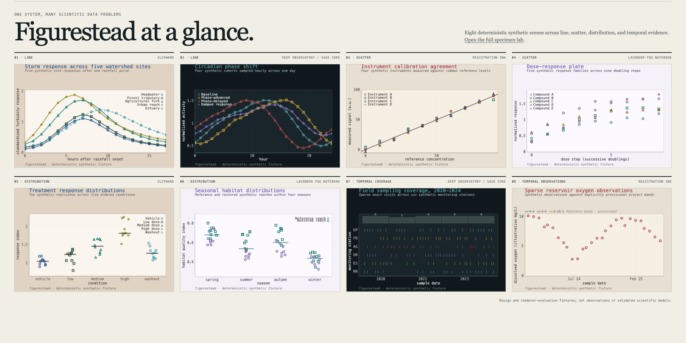
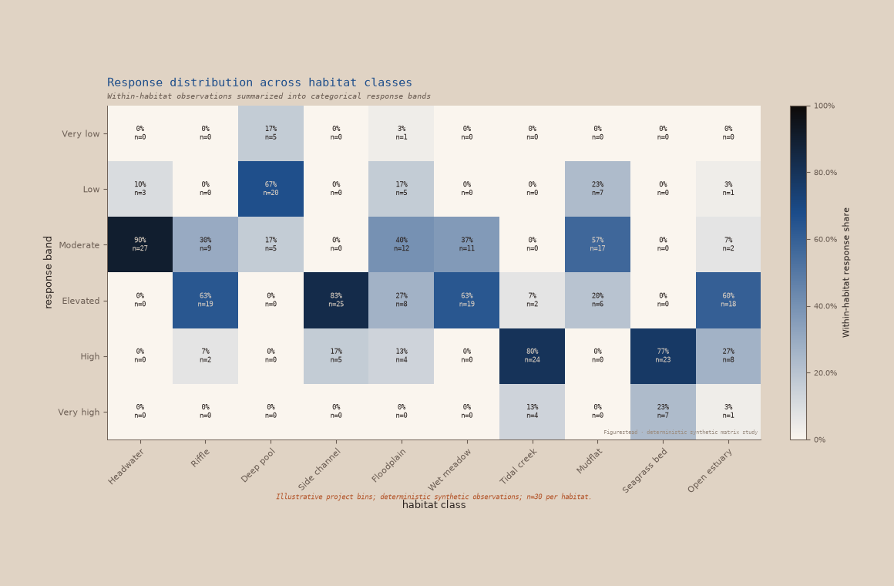

# Figurestead

Figurestead is an experimental scientific figure system with Python and framework-free browser surfaces. It shares figure-contract and theme semantics across runtimes while keeping scientific output deterministic and inspectable.

Published versions: Python `figurestead==0.9.0a3` and browser `@figurestead/web@0.9.0-alpha.4` ([alpha.4 release](https://github.com/CharlesMish/figurestead/releases/tag/v0.9.0-alpha.4)). The counters are independent. npm `alpha` points to alpha.4; `latest` intentionally remains alpha.1. The [retained release records](release/README.md) bind the exact published artifacts.

## Unpublished maintenance candidate

This checkout prepares Python `0.9.0a4` / browser `0.9.0-alpha.5` for independent
review, not registry publication. It includes the merged SVG typography/subtitle,
dense numeric-array, DirectLabels lifecycle, authored matrix-domain and
minimum-dependency repairs. See [candidate changes and limits](release/notes/0.9.0a4-web-alpha.5.md).
The published identities above and all historical images remain unchanged.

## Start here

The commands below review the retained local candidate from this checkout.
They do not fetch a new registry release. For the existing public release use
the exact published versions listed above.

### Python

```bash
python -m pip install ./release/python/0.9.0a4/dist/figurestead-0.9.0a4-py3-none-any.whl
```

```python
from figurestead import line

figure, axes = line([0, 1, 2], [[0, 1, 0]])
figure.savefig("figurestead-first-success.png", dpi=150)
```

[Open the exact Python example](examples/python-first-success.py).

### Browser

```bash
npm install ./release/npm/0.9.0-alpha.5/dist/figurestead-web-0.9.0-alpha.5.tgz
```

The package exports `createFigurestead`; rendering requires a complete normalized figure contract. The repository includes one with every identifier defined. From a checkout:

```bash
python3 -m http.server 4173
```

Open <http://127.0.0.1:4173/examples/browser-first-success/>. [Inspect the exact browser example and its inline contract](examples/browser-first-success/).

Python and browser surfaces share normalized figure-contract vocabulary and selected theme definitions. Each surface renders through its own implementation; shared semantics do not imply pixel-identical output.

## Series identity and optional direct labels

Default line series combine color with persistent open **circle (S1), square (S2), and upright triangle (S3)** markers and matching line-and-marker legends. Line rhythm remains an independent semantic channel. Python callers can carry `series_slots=[1, 2]` when rebuilding filtered S2/S3 rows; browser `setData` retains established keyed identity through supported filtering/reordering and partial style overrides. `setConfig` replaces the contract.

Lavender Fog Notebook is the reference light theme; Ultraviolet Laboratory is the reference dark theme for the [bounded three-series line profile](https://github.com/CharlesMish/figurestead/blob/v0.9.0-alpha.4/docs/reference-themes.md), not universal accessibility, CVD or print qualification. Default theme selections are unchanged.

Opt in with Python `line(..., direct_labels=True)` or browser `style: { directLabels: true }`. Direct labels reuse the actual body marker identity beside the traces. V1 covers ordinary one-panel, 2–3-series line figures with single-line printable ASCII labels. Unsupported or insufficient layouts fall back atomically to the ordinary legend. This treatment does not support Unicode, multiline or math interpretation; printable ASCII math punctuation is literal. Active browser transitions use ordinary treatment until settled, and exports without trustworthy measurement retain the ordinary legend.

See the [ordinary/direct-label example](https://github.com/CharlesMish/figurestead/tree/v0.9.0-alpha.4/examples/direct-series-labels) and [detailed direct-label contract](https://github.com/CharlesMish/figurestead/blob/v0.9.0-alpha.4/docs/direct-series-labels.md). The [explicit rendered-series contrast audit](https://github.com/CharlesMish/figurestead/blob/v0.9.0-alpha.4/docs/rendered-series-contrast.md) measures caller-specified rendering facts separately from the static palette audit.

## Current alpha: a3 / alpha.4

[Release notes](release/notes/0.9.0a3-web-alpha.4.md) distinguish these additions from the B2 identities, `series_slots`, baseline direct labels and bounded reference themes already shipped in a2/alpha.3:

- Python `series_keys` + keyed `line_styles` author rhythm independently of marker/color slots. Non-solid direct-label treatments in both runtimes add truthful line samples, subject to whole-legend fallback.
- Opt-in Python `marker_stride` / browser `style.markerStride` reduce marker density by authored index, preserving every line observation and segment. Default cadence is unchanged.
- Ordinary static Python lines accept NaN y as explicit breaks, preserving finite-run endpoints and isolated observations; they never reconnect or impute. Shared x stays finite, and gapped direct labels fall back.
- Python gains measured subtitle containment, [sequential heatmap colors](docs/sequential-heatmaps.md) and [dataset-owned histogram medians](docs/histogram-medians.md). Browser rhythm continuity, newcomer registration and scene integrity are corrected.

See [line semantics and limits](docs/line-series-semantics.md). These features are available in the published versions above. No new reference-theme or accessibility qualification is implied.

## Figurestead at a glance

[](docs/assets/readme/figurestead-at-a-glance.png)

This retained montage records earlier rendering, including prior dash-backed overflow. It is historical imagery, not a demonstration of current implicit rhythm. The montage spans temporal response, periodic series, calibration and nonlinear relationships, distributions, grouped distributions, exact temporal coverage, and sparse observations. These are deterministic synthetic design and renderer-evaluation fixtures—not scientific measurements or findings.

## Beyond the montage

[](docs/assets/readme/populated-categorical-response-matrix.png)

The populated categorical response matrix preserves ten habitat columns and six response-band rows. Fill encodes bounded within-habitat share while each cell retains its percentage and exact count. The fixture is deterministic and synthetic; its project-defined bands are not ecological or regulatory thresholds. [Inspect the source scene, raw observations, and derived matrices](specimen-study/matrix-study.html).

## Python and browser

Figurestead's two surfaces share a normalized contract vocabulary, selected theme definitions, and evidence-oriented conventions. They do not promise identical pixels or identical renderer coverage.

- Python provides the compact plotting API used by the first-success example and the existing categorical-matrix extension shown above.
- The framework-free browser package provides its accepted core renderer registry plus the temporal extension at `@figurestead/web/extensions/temporal`.
- The populated categorical matrix is currently Python-rendered; this README does not imply a browser categorical-matrix renderer exists.

## Evidence and documentation

- [Public overview](https://charlesmish.github.io/figurestead/)
- [Evidence Atlas](https://charlesmish.github.io/figurestead/evidence/)
- [Python first-success example](examples/python-first-success.py)
- [Python sizing, calendar ticks and comparison recipes](docs/python-layout-and-comparison.md) — includes unreleased note/count layout repairs
- [Browser first-success example](examples/browser-first-success/)
- [Python sequential heatmap ramp](docs/sequential-heatmaps.md) — published color mapping; numeric normalization unchanged
- [Static palette versus rendered-series contrast](docs/rendered-series-contrast.md)
- [Reference light/dark themes for the bounded three-series line profile](docs/reference-themes.md) — bounded exemplars, not universal qualification
- [Deterministic specimen corpus and local visual lab](specimen-study/README.md)
- [Technical-showcase reviewer packet](technical-showcase/reviewer-packet/README.md) — repository-local and undeployed

## Status and limits

Figurestead is an experimental public alpha, not a mature universal plotting library.

- The bounded persistent-identity reference profile covers the first three ordinary line series. Additional series use deterministic color/marker fallback but are not claimed to be independently distinguishable. Unconfigured lines remain solid at every series count; non-solid rhythm is authored semantics. This is [published alpha.4 behavior](docs/line-series-semantics.md), not a retroactive change to alpha.3.
- Digital paper evidence records a 6.372 pt minimum label against Figurestead's internal 6 pt project floor; it is not physical-printer certification or an external typographic standard.
- Color-vision-deficiency plates are simulations with documented model limits, not medical or universal-accessibility certification.
- Renderer coverage differs between Python and browser runtimes, and all specimens shown here are deterministic synthetic evaluation fixtures.

Figurestead is MIT licensed. See [versioning](VERSIONING.md), [third-party notices](THIRD_PARTY_NOTICES.md), and [trademarks](TRADEMARKS.md).
